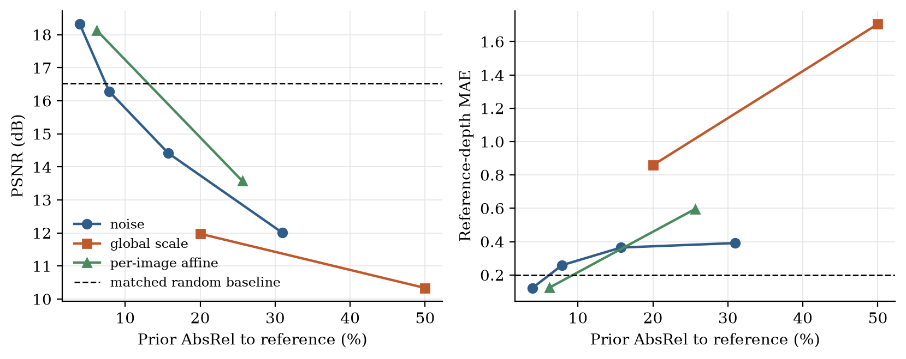
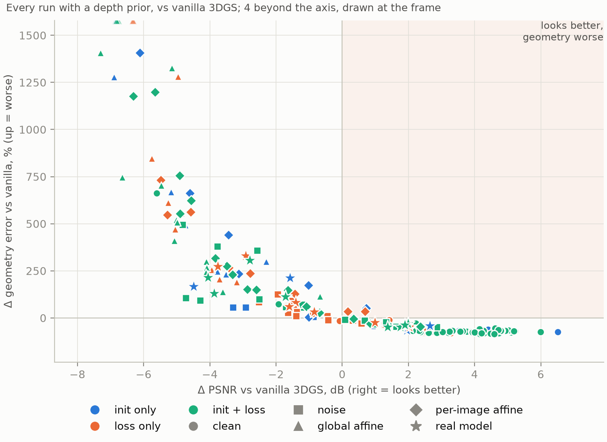

# When Do Depth Priors Help Sparse-View 3D Gaussian Splatting?

**A controlled study of appearance, geometry, and prior corruption**

Ameer Alayan · Moneer Ghanem — The Hebrew University of Jerusalem,
Deep Learning for 3D Computer Vision (final project)

**[Read the report (PDF)](report/report.pdf)** · [All 257 runs (CSV)](results/results.csv) · [Reproduce the study](docs/reproduce.md)

With only a few input views, 3D Gaussian Splatting (3DGS) can fit the images while
placing surfaces in the wrong place. Monocular depth is the standard remedy, used
either to initialize the Gaussians or as an extra training loss. This project
measures when that helps and when it hurts. Across 257 training runs it varies
how depth enters the reconstruction, how many views are available, which depth loss
is used and with what weight, and how wrong the depth prior is, then scores every
run on both rendered-image quality and 3D geometry.

## Key findings

- **Clean depth initialization helps both appearance and geometry.** At three views
  it raises held-out PSNR from 15.00 to 19.43 dB and cuts depth error by 70%
  compared with random initialization (Lego, Chair, Ship).
- **A small prior error can reverse the benefit.** In the three-view noise
  experiment, a prior with 3.9% error improves both measurements, while 7.9% error
  makes both worse than using no prior.
- **The structure of the error matters as much as its size.** A 20% global scale
  error leaves 2.2× the depth error of 31% pixel noise, and every one of the 32
  global-scale runs got worse on both measurements.
- **A real model is only as good as its calibration.** Depth Anything V2 helps when
  calibrated against reference depth (1.8% prior error) but not when made metric
  from 6–7 SfM points per synthetic view (24.7%). On real DTU scans, its depth
  initialization cuts Chamfer error by 45% compared with random initialization.
- **Image metrics can disagree with geometry, and with each other.** On DTU,
  adding a depth loss lowers Chamfer error by 34% and improves SSIM and LPIPS,
  while PSNR drops.

<p align="center">
  
</p>
<p align="center"><sub>Three-view corruption study on Lego and Chair: PSNR (left) and depth error (right) against the prior's error. The dashed line is the no-prior baseline.</sub></p>

<p align="center">
  
</p>
<p align="center"><sub>Every run with a depth prior relative to its matched no-prior baseline. Most damaged runs are worse on both axes; the shaded region holds runs whose renders improved while geometry got worse.</sub></p>

## Repository layout

| Path | Contents |
|---|---|
| [`src/`](src) | The method: data loading and view splits, Gaussians and rendering, known-pose SfM, depth losses, prior corruption, Depth Anything V2, metrics, analysis |
| [`scripts/`](scripts) | Command-line entry points: data preparation, reference depth, training, sweeps, evaluation, figures |
| [`configs/`](configs) | `base.yaml` (one training run) and `sweep.yaml` (the staged study) |
| [`notebooks/`](notebooks) | `colab.ipynb` runs the study on a Colab GPU; `analysis.ipynb` rebuilds tables and figures without a GPU |
| [`tests/`](tests) | CPU-only tests that pin down the semantics the results depend on |
| [`results/`](results) | `results.csv` (every run's metrics) and `reference_validation.json` |
| [`report/`](report) | The report, its LaTeX source and figures |
| [`docs/`](docs) | [Reproducing the study](docs/reproduce.md), [data preparation](docs/data.md), [design notes](docs/design.md) |

## Quick start

**Explore the results (CPU only).** Every number and figure in the report comes from
`results/results.csv`, so none of this needs a GPU:

```bash
python -m venv .venv && source .venv/bin/activate
pip install -r requirements.txt
python -m pytest tests -q                  # 83 tests
python scripts/make_report_figures.py      # redraw the report's figures
cd report && latexmk -pdf report.tex       # rebuild the report
```

`notebooks/analysis.ipynb` recomputes the analysis tables and the remaining figures
from the same file.

**Run the study (NVIDIA GPU).** The rasterizer, [gsplat](https://github.com/nerfstudio-project/gsplat),
needs CUDA. The study was run on Google Colab with `notebooks/colab.ipynb`; see
[docs/reproduce.md](docs/reproduce.md) for the full walkthrough, and
[docs/data.md](docs/data.md) for the datasets. On a GPU machine:

```bash
pip install -r requirements-gpu.txt
export DATA_ROOT=/path/to/data RUNS_ROOT=/path/to/runs
python scripts/make_gt_depth.py --scene lego chair ship              # reference depth
python scripts/run_sweep.py --sweep configs/sweep.yaml --stage stage1 --resume
python scripts/evaluate.py --runs "$RUNS_ROOT" --out results/results.csv
```

## The experiment

The study runs in stages defined in [`configs/sweep.yaml`](configs/sweep.yaml); each
stage builds on the settings selected by the previous ones. Configurations that
cannot produce an independent result are pruned automatically before training.

| Stage | Question | Runs |
|---|---|---|
| `stage0_repro` | Does our vanilla 3DGS reproduce the published 8-view baseline? (21.27 vs 22.23 dB) | 8 |
| `stage1` | Reference-depth, SfM or random initialization, at 3, 5 and 9 views | 27 |
| `stage2_init_loss` | Each initialization combined with a depth loss | 18 |
| `stage2_lambda` | Depth-loss weight × loss family (SSI, Pearson, absolute) | 48 |
| `stage3_noise`, `stage3_affine`, `stage3_perimage` | Controlled prior corruption, through initialization, loss, or both | 40 / 32 / 32 |
| `stage4_real` | Depth Anything V2 with reference-assisted and SfM-assisted calibration | 20 |
| `stage5_dtu_base`, `stage5_dtu_real`, `stage5_dtu_oracle` | Real scenes: DTU scans 1 and 6, official Chamfer evaluation | 8 / 16 / 8 |

Synthetic geometry is measured against a dense reference depth, a 3DGS reconstruction
fitted to all 400 views of each scene. We validated it against exact depth rendered
from the original Blender scenes: it is accurate to 0.22% on Lego and 0.36–0.38% on
Chair, the scenes behind the corruption study, but 2.3% off on Ship's water surface
([details](docs/data.md#reference-depth)).

## Implementation notes

- All code under `src/`, `scripts/` and `tests/` is ours; gsplat 1.5.3 is an installed,
  unmodified dependency. Two integration issues are corrected in our code: gsplat's
  rasterizer and densification strategy disagree on packed mode by default, and its
  opacity reset never fires because of an operator-precedence bug. Fixing both was
  worth +1.7 dB on Ship.
- SfM initialization is known-pose triangulation (SIFT, epipolar-checked matches, DLT),
  so it needs no COLMAP install.
- Geometry is reported without scale-and-shift alignment, because alignment would erase
  exactly the calibration errors the study injects.

More in [docs/design.md](docs/design.md).

## Limitations

The controlled study uses three NeRF-Synthetic scenes (corruption on two) and two DTU
scans, with one seed per configuration. The synthetic reference is a learned
reconstruction, accurate on Lego and Chair but not on Ship. The main study uses
view-independent color (SH degree 0), and DTU appearance is scored on full images, so
absolute numbers are not comparable to other papers.

## Acknowledgements

This project builds on [3D Gaussian Splatting](https://repo-sam.inria.fr/fungraph/3d-gaussian-splatting/),
[gsplat](https://github.com/nerfstudio-project/gsplat),
[Depth Anything V2](https://github.com/DepthAnything/Depth-Anything-V2), the
[NeRF-Synthetic](https://github.com/bmild/nerf) scenes, and the
[DTU MVS dataset](https://roboimagedata.compute.dtu.dk/?page_id=36). The reproduction
baseline is the 3DGS row reported by [DNGaussian](https://github.com/Fictionarry/DNGaussian).

## Citation

```bibtex
@misc{alayan2026depthpriors,
  title  = {When Do Depth Priors Help Sparse-View 3D Gaussian Splatting?
            A Controlled Study of Appearance, Geometry, and Prior Corruption},
  author = {Alayan, Ameer and Ghanem, Moneer},
  year   = {2026},
  note   = {Final project, Deep Learning for 3D Computer Vision,
            The Hebrew University of Jerusalem},
  url    = {https://github.com/AMEER7525/depth-prior-tax}
}
```
